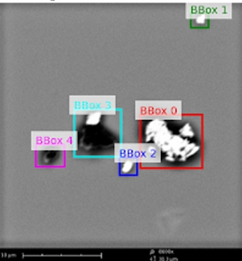
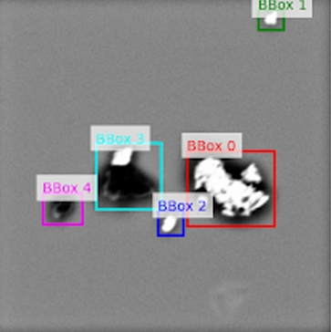

# Preprocessing Description

This document describes the preprocessing steps applied to the SEM images prior to
dataset release. The preprocessing pipeline was designed to ensure **responsible data
sharing**, **annotation consistency**, and **machine-learning readiness**, while
preserving the semantic integrity of defect regions.

---

## 1. Image Format Harmonization

The original SEM dataset contained images in multiple formats, primarily TIFF and JPEG.
To standardize downstream processing and reduce storage overhead, all images were
converted to a single format.

- **Target format:** PNG (grayscale, 8-bit)
- **Conversion policy:** Lossless preservation of intensity relationships
- **Directory structure:** Preserved during conversion
- **Annotation references:** Updated to match converted filenames

**Format Harmonization Details:**  
The conversion was performed in two stages:
1. **Initial standardization:**  
   - 119 TIFF files were converted to JPEG using a high-quality setting (`quality=95`) to ensure near-lossless intermediate storage.
2. **Final dataset format:**  
   - All images (original and augmented) were saved as **8-bit grayscale PNG**.  
   - Intensity values were normalized to \([0, 1]\) and reconverted to \([0, 255]\), preserving the original dynamic range and relative contrast of SEM acquisitions.  

The final distributed dataset contains exclusively grayscale PNG images with no additional compression artifacts.

---

## 2. Initial Annotation Inspection

Before further processing, the dataset was analyzed to verify annotation integrity:

- All annotations used **absolute pixel coordinates**
- Bounding boxes followed the format:  
  `[x, y, width, height]`
- Multiple bounding boxes per image were supported
- No normalized coordinates were detected

Initial inspection confirmed that bounding boxes were well-formed and within image bounds.

---

## 3. Scale Bar and Overlay Removal

Original SEM images contained embedded scale bars and acquisition overlays located near
the bottom of each image. These elements were removed to:

- Prevent scale-aware physical inference
- Avoid disclosure of acquisition-specific metadata
- Ensure compatibility with generic machine learning workflows

A **fixed percentage-based bottom crop (6% of the original image height)** was uniformly
applied to all images.

**Crop Definition:**  
- The crop height was computed as:  
  `crop_pixels = int(original_height × 0.06)`  
- As a result, the absolute number of pixels removed varied with image resolution.  
  - Example:  
    - 2048 × 2176 image → 130 pixels removed  
    - 1024 × 943 image → 57 pixels removed  
### Scale Bar Removal (Before and After)

  
  

  <em>Left: original SEM image with scale bar. Right: image after uniform bottom crop.</em>

This proportional approach ensured consistent removal of overlays while preserving
relative spatial content across images of different resolutions.

---

## 4. Bounding Box Adjustment After Cropping

Following cropping, bounding boxes were recalculated to remain spatially consistent:

- Bounding box coordinates were shifted to the new image reference frame
- Box dimensions were preserved where possible
- Bounding boxes falling entirely within the removed region were discarded

Results:
- **99.8% of bounding boxes were retained**
- No image lost all annotations
- No invalid bounding boxes were introduced

---

## 5. Post-Preprocessing Integrity Checks

After preprocessing:
- All images contained at least one valid bounding box
- All bounding boxes lay fully within image boundaries
- No annotation lists were empty
- Image resolution variability was preserved

These checks confirm that preprocessing did **not alter defect semantics** and did **not
introduce annotation artifacts**.

---

All preprocessing steps are intentionally conservative and uniformly applied across the
dataset.
