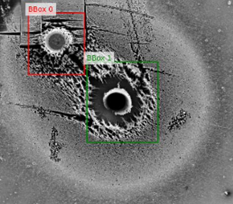
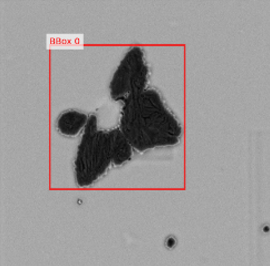
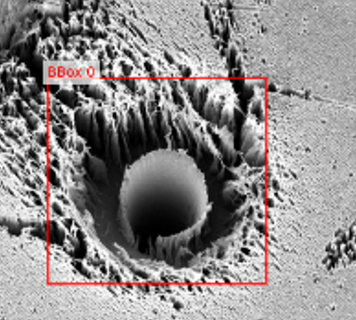
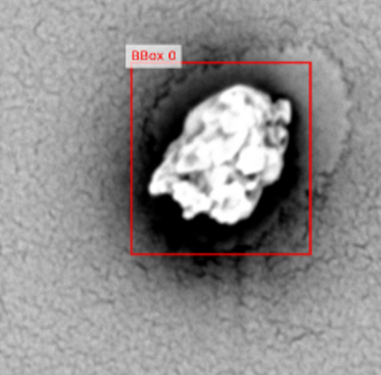

# PEM-SEM-Defect

**PEM-SEM-Defect** is a physically plausible, machine-learning–ready SEM image dataset for
**defect localization in polymer electrolyte membrane (PEM) fuel cell materials**.

The dataset is intended to support research in **defect localization** from scanning
electron microscopy (SEM) imagery, rather than defect classification or quantitative
materials metrology.

Due to dataset size constraints, the full dataset (images and annotations) is hosted on
**Zenodo**. This GitHub repository provides **documentation, dataset description, and
illustrative samples** to support correct and responsible reuse.

---

## Dataset Access

The complete dataset is publicly available on Zenodo:

**DOI:** https://doi.org/10.5281/zenodo.XXXXXXX

The Zenodo archive contains:
- 9,108 SEM images (original + augmented)
- Bounding-box annotations in JSON format
- Dataset metadata

---

## Visual Examples (Representative Samples)

Below are a few **representative SEM images** included for illustrative purposes only.
These samples are **not intended for training or evaluation**.

<p align="center">
  
  
</p>

<p align="center">
  
  
</p>

> Note: All sample images have been preprocessed to remove scale bars and acquisition
> annotations. The full dataset is available exclusively via Zenodo.

---

## Dataset Overview

- **Domain:** Scanning Electron Microscopy (SEM)
- **Application:** Defect localization in PEM fuel cell materials
- **Task type:** Supervised localization (bounding box prediction)
- **Image format:** PNG (grayscale)
- **Total images:** 9,108  
  - Each base image is represented by 1 original + 43 augmented variants
- **Annotations:** Bounding boxes enclosing defect regions

The dataset is released as a **single unified collection**. Original images are included
as part of the dataset and are not distributed as a separate subset.

---

## Preprocessing and Data Curation

To prevent leakage of acquisition-specific or proprietary information, all images were
preprocessed prior to release:

- Embedded scale bars and acquisition overlays were removed
- Images were cropped to exclude non-informative regions
- Bounding boxes were adjusted to remain spatially consistent after cropping

These steps preserve the semantic integrity of defect regions while ensuring responsible
data sharing.

Further details are provided in:
- `docs/preprocessing_description.md`

---

## Data Augmentation

Each base image was expanded using a fixed set of **43 physically plausible augmentations**,
resulting in 44 variants per image.

Augmentations were chosen to reflect realistic SEM acquisition variability, including:
- Mild blur (focus drift)
- Intensity and contrast variation
- Noise injection
- Resolution changes
- Compression artifacts

The augmentation strategy and its physical justification are documented in:
- `docs/augmentation_strategy.md`

---

## Annotation Format

Annotations are provided in JSON format and specify bounding boxes enclosing defect regions.

Details of the annotation schema, coordinate conventions, and usage guidelines are described
in:
- `docs/annotation_format.md`

---

## Intended Use

This dataset is intended for:
- Defect localization benchmarking
- Supervised and self-supervised learning on SEM imagery
- Studying augmentation effects in microscopy-based vision tasks

The dataset is **not intended** for:
- Defect classification benchmarks
- Scale-aware physical measurements
- Quantitative materials property estimation

---

## Repository Structure
```
sem-defect-localization-dataset/
│
├── README.md
├── LICENSE
├── CITATION.cff
│
├── docs/
│ ├── dataset_overview.md
│ ├── annotation_format.md
│ ├── preprocessing_description.md
│ └── augmentation_strategy.md
│
├── samples/
│ ├── sample_01.png
│ ├── sample_02.png
│ ├── sample_03.png
│ └── sample_04.png
```
This repository does **not** host the full dataset or annotations due to size constraints.

---

## Code Availability

This repository provides **documentation only**.

The full internal data generation, augmentation, and experimental pipelines are not
released, as they depend on restricted source data. Users are encouraged to implement
their own training pipelines using the documented dataset structure and annotation format.

---

## License

The dataset is released under the  
**Creative Commons Attribution–NonCommercial 4.0 International (CC BY-NC 4.0)** license.

See the `LICENSE` file for details.

---

## Citation

If you use this dataset in your research, please cite:


A `CITATION.cff` file is provided for automated citation support.

---

## Contact

For questions or clarifications, please open an issue in this repository.
